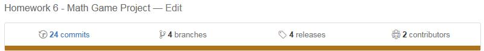

# Homework Assignment 6

## Abstract
The Homework 6 programming problem was to write a math game that included 
increasing difficulty as the problems were answered correctly and a decrease in 
difficulty if they were answered incorrectly. The development of the project was tracked using Git-SCM and GitHub was used as the remote repository server. Three classes were written for the project with the plan being to make the code useful for future projects. 

## Summary
Homework assignment 6 was to write a math game program that generated random addition problems. The player’s progress is tracked and as they answer the problems correctly through the four rounds of the game the level of difficulty is increased. If the answer to the problem is wrong then the level of difficulty is reduced. The player is awarded 5 points for each correct answer and they lose 5 points for each incorrect answer. The assignment also required the use of the Git-SCM software to track development. The program was first written as a single file and then later in the development the single file was broken into three files.

The nature of the program problem made the use of separate class files reasonable so a Player class was written to contain player information and provide methods to access and use that information. A class was also written to provide methods generating random numbers. This will allow for easy access to this code for use in future programs should the need arise.

The Git-SCM was used to track the project during development and it proved to be a valuable tool helping with tracking the development over various branches and then with the integration of the branches into one complete program. GitHub was also used giving access to the project during the development to interested persons who could make comments and suggestions as well as code corrections.


# Homework Assignment Number 6
This homework assignment is to write a program and use the Git-SCM to track program development. The programing problem is to create a math game that will generate at least four rounds of addition problems. The player will receive points for each correct answer and they will lose points for incorrect answers. Each time the player answers correctly the difficulty of the problems will be increased and if they answer incorrectly the difficulty of the problems will be decreased. The code for the program solution is below in three code sections, one for each of the java files. Following the code sections is some sample output for the program. The programming solution is also available on GitHub at (https://github.com/MDobrinski/COMSC_1033_HW_6_MathGame/releases). The release used for the homework assignment is v3.1.0.

The program consists of three classes, COMSC_1033_HW_6_Math_Game.java, Player.java, and MyRandoms.java. The file COMSC_1033_HW_6_Math_Game.java contains the main method as well as two other methods. The Player.java file contains the methods needed to create Player objects used in the main program and the MyRandoms.java file contains methods used to generate various random numbers.

## CODE – COMSC_1033_HW_6_Math_Game.java
```java
/** @author Michael Dobrinski - michael.git2015@gmail.com
 * COMSC 1033 Section 1411
 * Instructor: Dr. Evert
 * 27 September 2015
 */

/** Homework number 6
 *
 * Let us make a math game. The user will be asked a simple math problem in
 * the first round. For example, to add two single digit numbers. If the user
 * gets this correct, they will be given points and asked a more difficult
 * math problem in round 2, such as adding a pair of two digit numbers.
 * They will receive more points and be asked more difficult questions in the
 * following round for every correct answer. Every incorrect answer will be
 * followed by a more simple question. There should be a total of 4 rounds.
 * At the end of 4 rounds, the code should print the final score.
 */

import java.util.InputMismatchException;
import java.util.Scanner;

public class COMSC_1033_HW_6_Math_Game {
	public static Scanner inputAnswer = new Scanner(System.in);
	public static Player player_1 = new Player(); // Create player object


	public static void main(String[] args) {
		int num1 = 0, num2 = 0;
		player_1.setLevel(1); // Initialize level
		player_1.setScore(0);	// Initialize score
		player_1.setRightAnswers(0); // Initialize the number of correct answers
		player_1.setWrongAnswers(0); // Initialize the number of wrong answers

		Scanner input = new Scanner(System.in);
		System.out.print("\nPlease enter your first name: ");
		String playerName = input.nextLine();
		player_1.setName(playerName);

		System.out.print("\n\n************************************************" +
		"*************************************\n");
		System.out.printf("Welcome %s! The rules for the game are:\n",
				player_1.getName());
		System.out.printf("The game consists of four rounds of addition problems"+
		" randomly generated. Each time the \nproblem is answered correctly"+
		" you will receive 5 points and the difficulty level\nwill increase. "+
		"If the problem is answered incorrectly you will lose 5 points and "+
		"the\ndifficulty level will be reduced.");

		for(int round=1; round<=4; round++){
			// Make sure level does not go below 1.
			player_1.setLevel( (player_1.getLevel()<1)? 1: player_1.getLevel());

			switch (player_1.getLevel()){
				case 1:
					num1 =  MyRandoms.get1DigRandom();
					num2 =  MyRandoms.get1DigRandom();
					roundResult(num1, num2, round);
					break;

				case 2:
					num1 =  MyRandoms.get2DigRandom();
					num2 =  MyRandoms.get2DigRandom();
					roundResult(num1, num2, round);
					break;

				case 3:
					num1 =  MyRandoms.get3DigRandom();
					num2 =  MyRandoms.get3DigRandom();
					roundResult(num1, num2, round);
					break;

				case 4:
					num1 =  MyRandoms.get4DigRandom();
					num2 =  MyRandoms.get4DigRandom();
					roundResult(num1, num2, round);
					break;
				default:

			}	// End of switch.
		} // End of for loop.

// Print out the final results of the game.
		System.out.printf("\n\n***************************************************"
				+ "****************\n************************** Final Results ********"
				+ "******************\n");
		System.out.printf("%s your final score is %d points and you answered %4.1f"
			+ "%% of\nthe questions correctly.", player_1.getName(),
			player_1.getScore(),
			(double)player_1.getRightAnswers() /player_1.getTotalAnswers()*100.0);

		input.close();				// Close our inputs
		inputAnswer.close();
	} // ******************** End of MAIN method ****************************

/**
 * Method to calculate the result of the round of addition.
 * Inputs: the two numbers for the problem, the player name, and round number
 * Output: The method does not return a value but modifies the global Player
 * object - score and level.
 */

	private static void roundResult(int num1, int num2,	int round) {
		int playerAnswer=0;
		int correctAnswer;
		boolean error = false;
		printRoundHeader(round);
		correctAnswer = num1 + num2;

		do {
			System.out.printf("Answer the problem: %d + %d = ", num1, num2);

		try {
			playerAnswer = inputAnswer.nextInt(); // Moved this from its own method.
			error = false;
		} catch (InputMismatchException ex){
			error = true;
			System.out.print("\nERROR on input: Try again with integer numbers"
				+ " only.\n");
			inputAnswer.nextLine(); // Flush the input buffer.
		}

	} while (error);
	if (playerAnswer == correctAnswer){
			player_1.adjustScore(5);
			player_1.adjustLevel(1);
			player_1.adjustRightAnswers(1);
			System.out.print("CORRECT");
		}
		else{
			player_1.adjustScore(-5);
			player_1.adjustLevel(-1);
			player_1.adjustWrongAnswers(1);
			System.out.print("INCORRECT");
		}
	} // End of roundResult

	/**
	 * Method to print header information at the start of each round.
	 * Inputs: int score, int round, int level, string player's name
	 * Output: void
	 */
	public static void printRoundHeader(int r){
		System.out.printf("\n\n***************************************************"
			+ "****************\n***************************** Round %d *************"
			+ "****************\n",r);

		System.out.printf("\n%s your score is %d and you are at a difficulty"
			+ " level of %d.\n", player_1.getName(), player_1.getScore(),
			player_1.getLevel());
	} // End of printRoundHeader.

} // **************** End of COMSC_1033_HW_6_Math_Game class ********
```

The COMSC_1033_HW_6_Math_Game.java file consists of three methods, main, roundResult, and printRoundHeader. The program instantiates the Player object player_1 and the Scanner object inputAnswer outside of the main method giving both objects scope throughout the class. Inside the main method several of the player_1 attributes are initialized and another Scanner object, input, is created. The main method then prompts the user for their first name using the Scanner object input to get the string using nextLine. After the player name is read the program displays a welcome message and explains the rules of the game. Following this the game starts.

A FOR loop makes up the body of the game and is used to control the number of rounds. Inside the FOR loop is a SWITCH construct that contains four CASEs. The difficulty level, level variable, is used as the control for the SWICH so that based on the level variable, the appropriate CASE is executed. Inside each CASE two random numbers are obtained with CASE 1 getting one digit integers, CASE 2 getting two digit integers and so on. After the random integers for that round are found then the roundResults method is called. The inputs for the roundResults method are the two random integers and the round number.

Inside the roundResult method the printRoundHeader method is used to display the status of the game showing the player name, score, and level. After execution returns from the printRoundHeader method the correct answer is calculated and the program enters a DO – WHILE loop. Inside the DO – WHILE loop the addition problem is displayed and the player is prompted for the answer. The prompt for the answer is contained in a TRY block followed by a CATCH block to handle any InputMismatchExceptions should the player enter anything other than an integer for their answer. 

If there is an InputMismatchException the CATCH block displays an error message, clears the inputAnswer object stream, and sets the Boolean variable error to true causing the DO – WHILE loop to execute again. If the player enters a valid number for the answer then the variable error is set to false and the program exits the DO – WHILE loop.

Once program execution exits the DO – WHILE loop the player’s answer to the problem is compared to the correct answer, calculated earlier in the method, in an IF – ELSE construct. If the player answer is equal to the correct answer then the player score is adjusted by a positive 5 points, the level is adjusted by a positive 1, the number of right answers is increased by 1, the message “CORRECT” is displayed, and program execution returns to the CASE from which the roundResult method was called. The program breaks out of the SWITCH and the next iteration of the FOR loop is executed as long as the variable round is less than or equal to four.

If the player answer does not equal the correct answer then the player score is adjusted by a negative 5 points, the level is adjusted by a negative 1, the number of wrong answers is increased by 1, the message “INCORRECT” is displayed, and program execution returns to the CASE from which the roundResult method was called. The program breaks out of the SWITCH – CASE and the next iteration of the FOR loop is executed as long as the variable round is less than or equal to four. Once the variable round exceeds 4 the FOR loop exits and the final results are displayed showing the player score and the percentage of problems that were answered correctly. Then the Scanner objects inputAnswer and input are closed. Below is the code for the other two classes in the project.

## CODE – Player.java
```java
/************************** Player.java ********************************
 * Player class is used to create Player objects.
 * There are two constructors for this class:
 * Player() - creates the object with no values
 * Player(String name) - creates the object and assigns name to the name
 * 												variable.
 * There are five (5) variables for each Player object: name, level, score,
 * rightAnswers, and wrongAnswers.
 * There is one (1) class variable, numOfPlayers, that counts the number of
 * Player objects created in the program.
 *
 */
public class Player {
	private String name;
	private int level=0;
	private int score=0;
	private static int numOfPlayers=0;
	private int rightAnswers=0;
	private int wrongAnswers=0;

	public int getTotalAnswers() { // Return the total number of answers
		return rightAnswers + wrongAnswers;
	}

	public int getRightAnswers() { // Return number of correct answers
		return rightAnswers;
	}
// Set the number of correct answers to value specified by the program
	public void setRightAnswers(int rightAnswers) {
		this.rightAnswers = rightAnswers;
	}
// Increment the number of correct answers by the value given by the program
	public void adjustRightAnswers(int changeToRA){
		rightAnswers += changeToRA;
	}

	public int getWrongAnswers() { // Return the number of wrong answers
		return wrongAnswers;
	}
//Set the number of incorrect answers to value specified by the program
	public void setWrongAnswers(int wrongAnswers) {
		this.wrongAnswers = wrongAnswers;
	}
//Increment the number of incorrect answers by the value given by the program
	public void adjustWrongAnswers(int changeToWA){
		wrongAnswers += changeToWA;
	}

	public String getName() {	// Return the player's name
		return name;
	}

	public void setName(String name) { // Set the name of the player
		this.name = name;
	}

	public int getLevel() { // Return the player's level in the game
		return level;
	}

	public void setLevel(int level) { // Set the player's level
		this.level = level;
	}
// Increment the level by the amount given by the program
	public void adjustLevel(int levelChange){
		level += levelChange;
	}

	public int getScore() {	// Return the player's score
		return score;
	}

	public void setScore(int score) { // Set the player's score
		this.score = score;
	}

	public void adjustScore(int scoreChange){ // Adjust the player's score
		score += scoreChange;
	}

	public static int getNumOfPlayers(){	// Get the number of player instances
		return numOfPlayers;
	}

	// ***************** Constructors ****************************************
	public Player(){ // Create a generic player without a name
		numOfPlayers++;
	}

	public Player(String name) { // Create a named player
	this.name = name;
	numOfPlayers++;
	}
} // *********** End of Player class ******************
```

The Player class is used to create a Player object that contains information about the player during the game. The class contains two constructor methods, one that can be used to instantiate an empty Player object and the other to instantiate a Player object with the name information provided at the time of instantiation. There are getter and setter methods used to manipulate the various Player variables that contain player information such as: name, score, level, number of correct answers, and number of incorrect answers. Writing the class in this manner protects the object information from direct manipulation by the program. There is one static variable called numOfPlayers that is used to keep count of the number of Player objects that are created should that information be needed in future uses of the class. 
## CODE – MyRandoms.java
```java
/***************************** MyRandoms.java****************************
 * The MyRandoms class has 4 methods that can be called to generate random
 * numbers using the Math.random method provided by Java.
 * Each method will generate a random number with the specified number of
 * digits. get1DigRandom gives a single digit random integer number between
 * 0 and 9 inclusive, that is (0<= number <=9).
 * get2DigRandom gives a two digit random integer number between
 * 10 and 99 inclusive, that is (10<= number <=99).
 */
public class MyRandoms {

	/**
	 * Generate a random number between mn (minimum) and mx (maximum) inclusive.
	 * Inputs: int minimum boundary, int maximum boundary
	 * Output: random integer between mn and mx inclusive.
	 */
	public static int randomNumber(int mn, int mx){
		return ((mx - mn + 1) * (int)(Math.random()*100000)) / 100000 + mn;
	}
// Return a random integer between 0 and 9 inclusive. 0<= random <=9
	public static int get1DigRandom (){
		return  (10 * (int)(Math.random()*100000)) / 100000;
	}
//Return a random integer between 10 and 99 inclusive. 10<= random <=99
	public static int get2DigRandom (){
		return  (90 * (int)(Math.random()*100000)) / 100000 + 10;
	}
//Return a random integer between 100 and 999 inclusive. 100<= random <=999
	public static int get3DigRandom (){
		return  (900 * (int)(Math.random()*100000)) / 100000 + 100;
	}
//Return a random integer between 1000 and 9999 inclusive. 1000<= random <=9999
	public static int get4DigRandom (){
		return  (9000 * (int)(Math.random()*100000)) / 100000 + 1000;
	}
} // ************** End of MyRandoms class ********************
```

The program required the generation of random numbers containing a varying number digits based on the difficulty level of the round in the game so the following formula was used to get the numbers: ((max - min + 1) * (int)(Math.random()*100000)) / 100000 + min. The Java Math.random method returns a double value that is greater than or equal to 0.0 and less than 1.0. Using that value the formula above will generate an integer value that is greater than or equal to min and less than or equal to max. The random number generation is contained in a class separate from the main class.

The MyRandoms class is used to provide various random integers to the calling program. There are five methods in the class get1DigRandom, get2DigRandom, get3DigRandom, get4DigRandom, and randomNumber. The 1, 2, 3, or 4 in the getXDigRandom methods indicate the number of digits in the random integer the method returns. As an example, the get3DigRandom method returns a three digit integer between 100 and 999 inclusive. The randomNumber method accepts two integer inputs and returns a random integer between the two inputs inclusive. Each of the methods in the MyRandoms class use the Math.random method that is included in the Java library. It was decided to put the random number methods in a separate class to make it easier to reuse the code in future projects. 

Some sample output from the program is provided in the console section below.

## CONSOLE
```
Please enter your first name: August


*************************************************************************************
Welcome August! The rules for the game are:
The game consists of four rounds of addition problems randomly generated. Each time the 
problem is answered correctly you will receive 5 points and the difficulty level
will increase. If the problem is answered incorrectly you will lose 5 points and the
difficulty level will be reduced.

*******************************************************************
***************************** Round 1 *****************************

August your score is 0 and you are at a difficulty level of 1.
Answer the problem: 1 + 6 = 7
CORRECT

*******************************************************************
***************************** Round 2 *****************************

August your score is 5 and you are at a difficulty level of 2.
Answer the problem: 78 + 63 = 141
CORRECT

*******************************************************************
***************************** Round 3 *****************************

August your score is 10 and you are at a difficulty level of 3.
Answer the problem: 140 + 909 = 1049
CORRECT

*******************************************************************
***************************** Round 4 *****************************

August your score is 15 and you are at a difficulty level of 4.
Answer the problem: 8511 + 3714 = 12225
CORRECT

*******************************************************************
************************** Final Results **************************
August your final score is 20 points and you answered 100.0% of
the questions correctly.
```

The Git-SCM software was used to track the source code during the development of the programming project and GitHub was used as the remote repository server for the project. The program was first written with all of the methods for the program contained in a single class. During the writing of the program Git was used to track progress and incremental commits were used so that if it was needed the program could be reverted to an earlier state to correct problems. Once the program was working, a branch off of the master was created to track development while error checking was added to the program. The project contains a total of four branches in Git, they are: master, errorTrap, patch-1, and development. A feature for the program would be developed on a branch off of the master and once it was working that branch would be merged back into the master. During a couple of the merges conflicts arose between the source code in the two branches being merged. Once these conflicts were resolved the merge was completed and development continued. Using GitHub allowed the project to be reviewed by other programmers during the development process and their input was used to correct any errors. One such error was pointed out by instructor Jonathan Irvin who pointed out the need to correct a spelling mistake. He created a couple of pull requests, one to help with a merge conflict in the code and one for the spelling error.

After the program was working correctly it was decided to move some of the functionality out of the single class and into separate classes with the development of the Player and MyRandoms classes. The writing of these classes was done on the development branch which was merged into the master branch as the use of the classes became functional in the program. Pictures of the project statistics and development graph from GitHub are shown below.

 
 
 
 
A screenshot of the gitk command is shown below. This gives a history of the project to date.


 
The current release for this programming project at the time this report is being written is v3.1.0 and a link to the project is included at the beginning of the report.

This programming problem has given the opportunity to use a number of program control constructs including the SWITCH – CASE construct, DO – WHILE loop, FOR loop, and IF – ELSE construct. The Math.random method provided in the Java utilities was also used. This project was such that object and method classes could be written and used effectively, allowing for their use in future programs. Numerical input from the user is contained in a TRY block and any InputMismatchExceptions will be handled in the CATCH block. The Git-SCM system was a valuable tool used during the writing of this programming project as well as GitHub for a central repository server.
